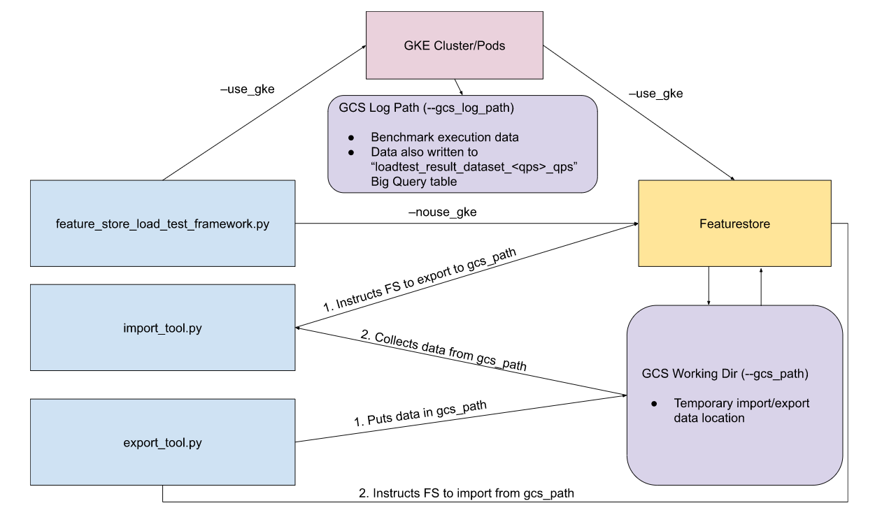

# Vertex AI Benchmarker

## Overview

Vertex AI Benchmarker tests your Vertex AI Resources's performance by spinning
up Kubernetes pods that repeatedly exercise the Vertex API.

Current support exists for the
[Feature Store API](http://cloud/vertex-ai/docs/featurestore).

The Benchmarker consists of a Python [cli](/cli) and a Java [worker](/worker).
Users should not interact with the worker directly. When interacting with the
cli, commands should be run from within the cli directory.

> **Warning**: Running this benchmarking framework against production resources
> can lead to rate limiting, quota limits, and other production issues.

## Data Flow

Vertex AI Benchmarker's data flow is as follows.

<div align="center">
  
</div>

<br>

Generally, the Vertex AI benchmarker interacts with and stores benchmark data on
the local machine or within user-owned GCP resources (such as GCS objects, Big
Query tables, and GKE clusters).

## Setup

### Google Cloud CLI

Installing gcloud:

https://cloud.google.com/sdk/docs/install-sdk

Set default application credentials to be used by the tool:

```sh
gcloud auth application-default login
```

Also set the default project:

```sh
gcloud config set project <your-project-name>
```

Install the gcloud kubectl component:

```sh
gcloud components install kubectl
```

### Install Python Dependencies

Python dependencies are installed in a virtual environmet.

Execute the following within `cli`.

```sh
python3 -m venv env
. env/bin/activate
pip install -r requirements.txt
```

## Usage

### Importing Data

The benchmarker provides a utility to import Feature Store data from a flat text
file.

Vertex AI Benchmarker provides a sample
[featurestore.txt](cli/data/featurestore.txt) file that can be used for
importing and testing.

See [Exporting Data](#exporting-data) for details on how to export existing
Feature Store data.

#### Example usage

```sh
./import_tool.py \
  --project_id <a-project-id> \
  --region <a region e.g. us-east4> \
  --gcs_path <path to bucket used as working directory e.g. gs://vertex-ai-benchmarker-working-dir> \
  --import_file_path data/featurestore.txt
```

The format of the import file is detailed in the
[Import/Export File Section](#import_export-file).

> **Note**: Execution may take 30+ minutes.

### Running the Benchmarker

The benchmarker worker can be run locally (using `--nouse_gke`), with a new GKE
cluster, or an existing GKE cluster. Using a GKE cluster requires building a
docker image and uploading the image to the Google Container Registry.

#### Example usage (local worker)

```sh
./feature_store_load_test_framework.py \
  --project_id <a-project-id> \
  --region <a region e.g. us-east4> \
  --feature_query_file_path <path to query template used for querying Feature Store e.g. $(pwd)/data/query_file.textproto> \
  --entity_file_path <path to a list of entities used for querying Feature Store e.g. $(pwd)/data/entity_file.txt> \
  --nouse_gke
```

> **Note**: The `feature_query_file_path` and `entity_file_path` args should be
> absolute paths.

An example feature_query_file lives at
[cli/data/query_file.textproto](cli/data/query_file.textproto). See the
[Feature Query File](#feature-query-file) section for more details.

An example entity_file_path lives at
[cli/data/entity_file.txt](cli/data/entity_file.txt). See the
[Entity File](#entity-file) section for more details.

> **Note**: If you used the `data/featurestore.txt` example file during import,
> then the `data/query_file.textproto` and `data/entity_file.txt` example files
> can be used as a proof of concept by replacing the featurestore
> `benchmark_featurestore_abc123` with the featurestore id created during
> import.

#### Example usage (GKE Cluster)

Running the load test framework on a GKE cluster requires creating a worker
docker image and uploading it to GCR.

Installing docker is outside of the scope of this README.

*Build the image*

```sh
cd ../worker
IMAGE_ID=$(sudo docker build . | tee /dev/tty | grep "Successfully built" | cut -d " " -f 3)
cd -
```

*Upload to GCR*

```sh
gcloud services enable containerregistry.googleapis.com
gcloud auth configure-docker

sudo docker tag $IMAGE_ID gcr.io/<project>/vertex-ai-benchmarker:latest

# Note if you do not have sudoless docker enabled, you may need to set
# up gcloud auth using sudo (`sudo gcloud auth login`)
docker push gcr.io/<project>/vertex-ai-benchmarker:latest
```

See
[Pushing and pulling GCR images](http://cloud/container-registry/docs/pushing-and-pulling)
for more info on uploading images to GCR.

Once the image has been uploaded to GCR, the benchmarker can be run as follows:

```sh
./feature_store_load_test_framework.py \
  --project_id <a-project-id> \
  --region <a region e.g. us-east4> \
  --feature_query_file_path <path to query template used for querying Feature Store e.g. $(pwd)/data/query_file.textproto> \
  --entity_file_path <path to a list of entities used for querying Feature Store e.g. $(pwd)/data/entity_file.txt> \
  --image_url gcr.io/<a-project-id>/vertex-ai-benchmarker:latest \
  --gcs_log_path <where to write benchmark logs e.g. gs://vertex-ai-benchmarker-working-dir/fsloadtest_logs>
```

> **Note**: The `feature_query_file_path` and `entity_file_path` args should be
> absolute paths. GCS urls are also accepted (`gs://...`).

The target QPS is spread out across all the pods.

See `./feature_store_load_test_framework.py --help` for a full list of
arguments.

##### Reusing an existing cluster

To avoid creating and tearing down the GKE cluster every test run, pass
`--keep_cluster` on the first run. On subsequent runs, pass the
`--existing_cluster_name <CLUSTER_NAME>` argument.

### Exporting Data

The `export_tool.py` script can be used to export featurestore data from an
existing featurestore.

```sh
./export_tool.py \
  --project_id <a-project-id> \
  --region <a region e.g. us-east4> \
  --gcs_path <path to bucket used as working directory e.g. gs://vertex-ai-benchmarker-working-dir> \
  --featurestore_id_regex benchmark_featurestore \
  --export_file_path exported_featurestore_data.txt
```

See `./export_tool.py --help` for a full list of arguments.

### Import/Export, Feature Query, and Entity Files

#### Import/Export File

The import/export flat file format is as follows:

```
featurestores/benchmark_featurestore/entityTypes/human/entities/user_a@gmail.com/features/weight/featureDataTypes/DOUBLE/featureValues/1
```

Each line represents a feature value and encodes the featurestore (e.g.
`benchmark_featurestore`), entity_type (e.g. `human`), entity (e.g.
`user_a@gmail.com`), feature (e.g. `weight`), feature_type (e.g. `DOUBLE`), and
feature value (e.g. `1`).

This file is generated using the [cli/export_tool.py](#exporting-data) util
script and imported using the [cli/import_tool.py](#importing-data) util script.

See [cli/data/featurestore.txt](cli/data/featurestore.txt) for a larger example.

#### Feature Query File

The Feature Query File provides a template of requests to execute against each
featurestore.

```textproto
# proto-file: featurestore_online_service.proto
# proto-message: Requests

requests_per_featurestore: {
  featurestore_id: "benchmark_featurestore_abc123"
  requests: {
    read_feature_values_request: {
      entity_type: "human"
      entity_id: "${ENTITY_ID}"
      feature_selector: {
        id_matcher: {
          ids: ["*"]
        }
      }
    }
  }
}
```

Multiple `requests_per_featurestore` blocks can be passed, each specifying the
set of requests to execute against a feature store.

See
[worker/lib/protos/featurestore_online_service.proto](worker/lib/src/main/java/featurestoreloadtestframework/lib/protos/featurestore_online_service.proto)
for full schema.

See the
[Feature Store Documentation](https://cloud.google.com/vertex-ai/docs/featurestore/serving-online#serve_values_from_multiple_entities)
for details on the `feature_selector` field.

#### Entity File

Lists out the entities to be queried. Entity ids will be substituted into the
`${ENTITY_ID}` placeholder in the feature query file for each request.

Example:

```
featurestores/benchmark_featurestore_abc123/entityTypes/human/entity/user_a@gmail.com
featurestores/benchmark_featurestore_abc123/entityTypes/human/entity/user_b@gmail.com
featurestores/benchmark_featurestore_abc123/entityTypes/human/entity/user_c@gmail.com
```

## Support

This is not an officially supported Google product such as Android, Chromium,
and Go. Support and/or new releases may be limited.

## Contributing

See [`CONTRIBUTING.md`](CONTRIBUTING.md) for details.

### Running Unit Tests

From within the `cli` directory, execute the following to run all tests:

```sh
ls lib/*_test.py | \
  sed -e 's:^lib/:lib.:' -e 's/.py$//' | \
  xargs -I {} sh -c 'python3 -m {} && echo || exit 255'
```

To run a single test file, exec:

```sh
# e.g. python3 -m lib.framework_runner_test
python3 -m lib.<test_name>
```

## License

Apache 2.0; see [`LICENSE`](LICENSE) for details.
